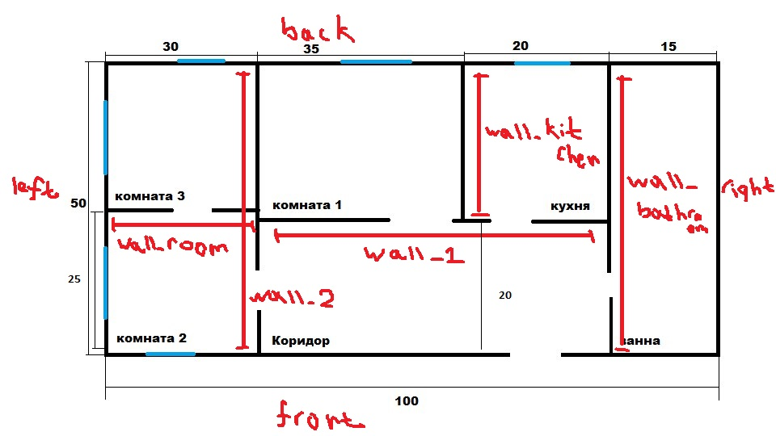

## Паттерн Строитель

**Строитель** (англ. Builder) — порождающий шаблон проектирования предоставляет способ создания составного объекта.

Он отделяет конструирование сложного объекта от его представления, позволяя использовать один и тот же процесс конструирования для создания объектов с различным состоянием.

- Алгоритм создания сложного объекта не должен зависеть от того, из каких частей состоит объект и как они стыкуются между собой;
- Процесс конструирования должен обеспечивать различные представления конструируемого объекта.

**Плюсы:**

- Позволяет изменять внутреннее представление продукта;
- Изолирует код, реализующий конструирование и представление;
- Дает более тонкий контроль над процессом конструирования.

----------

#### Задание

Добавить новую схему рабочей области – *трехкомнатную квартиру*.

**Схема квартиры:**

#### Структура файлов

- `PlanBuilder.h`
- `EmptyPlanBuilder.h`
- `Items.h` - дополнительные классы (стены, двери, окна);
- `Plan.h`
- `Director.h`
- `ThreeRoomsApartment.h` - трехкомнатная квартира;
- `main.cpp` - программа для рисования квартиры.

